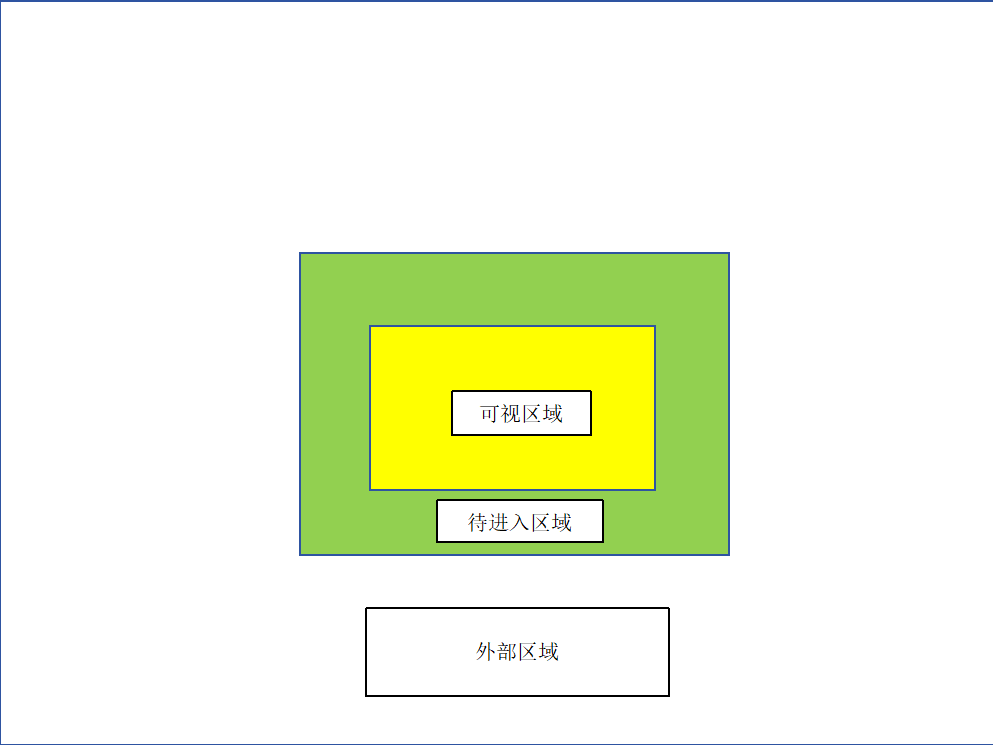

# 题目
* 假定一个2D场景中有数量众多且分布不均匀的（10w+）gameobject，摄像机在场景中自由移动，请按照您对场景管理的理解，自定设计目标，设计一个管理机制来管理这些gameobject，可用伪代码表达，并辅以必要的文字说明。  

# 设计目标
* 性能优化：尽量减少无效的 GameObject 更新和渲染。
* 可见性管理：根据摄像机视口动态加载和卸载 GameObject。
* 分区管理：使用空间划分技术（如四叉树）来组织 GameObject。

# 整体思路
* 针对大场景的实时渲染，如果所有的物体都创建出来，会浪费很多不必要的资源，我们只需要显示出当前摄像机可视区域的物体就可以了
* 我们需要在每帧更新相机，同时要动态显隐周围的物体，如果每帧都遍历10w+的数据，也会有很大的性能问题，这里我们通过四叉树来管理场景信息，实现快速索引物体信息。 在遍历摄像机周围物体时，构建3个缓冲区：可视区域，待进入区域，外部区域，随着相机移动，三个区域的物体做交换，来实现动态显示物体。


# 管理机制设计
### DynamicLoadData
* 预先通过离线工具将场景所有gameobject编码，记录每个物体所占格子，位置信息，包围盒信息等。

### QuadTree
* 构建四叉树将场景划分成多个层级，可以实现高性能遍历场景信息

### GameObjectManager
* 负责管理所有 GameObject 的生命周期，包括加载、卸载和更新。

### Camera
* 代表视口，根据摄像机的位置更新可见 GameObject。

### 伪代码示例
```csharp
class QuadTree {
    Quadtree(Rect bound)
    {
        _root = new QtreeNode(bound);
        BuildRecursively(_root);// 将场景划分成小格子，并构建出四叉树
    }

    void Update(Vector2 focusPoint)
    {
        // 先处理待进入进出列表
        PerformSwapInOut(_focusLeaf);

        if (processTime passed) // 等待一段时间
            // 将待进入的加入holding列表
            ProcessSwapQueues();
    }

    void Receive(SceneQtreeeUserData qud)
    {
        _root.Receive(qud);
    }

    void PerformSwapInOut(QtreeNodeLeaf activeLeaf)
    {
        GenerateSwappingLeaves(_root, activeLeaf, _holdingLeaves, inLeaves, outLeaves);

        foreach (var item in _swapInQueue)
        {
            inLeaves.Remove(item);
        }

        SwapIn(inLeaves);
        SwapOut(outLeaves);
    }

    void SwapIn(HashSet<QtreeNodeLeaf> inLeaves)
    {
        foreach(var item in inLeaves)
        {
            _swapInQueue.Add(item);
        }
    }

    void SwapOut(HashSet<QtreeNodeLeaf> outLeaves)
    {
        foreach (var leaf in outLeaves)
        {
            _holdingLeaves.Remove(leaf);
            _swapOutQueue.Add(leaf);
        }
    }

    void ProcessSwapQueues()
    {
        foreach (var item in _swapInQueue)
        {
            _holdingLeaves.Add(item);
        }
    }

    Rect SceneBound
    Vector3 FocusPoint

    QtreeNode _root;
    QtreeNodeLeaf _focusLeaf;

    // 当前可视区域节点
    HashSet<QtreeNodeLeaf> _holdingLeaves = new HashSet<QtreeNodeLeaf>()
    // 待进入可视区域节点
    HashSet<QtreeNodeLeaf> _swapInQueue = new HashSet<QtreeNodeLeaf>()
    // 外部区域节点
    HashSet<QtreeNodeLeaf> _swapOutQueue = new HashSet<QtreeNodeLeaf>()
}

//树节点
public class QtreeNode
{
    QtreeNode[] SubNodes;
    Rect Bound;

    QtreeNode[] subNodes;
    Rect bound;

    QtreeNode(Rect bound)
    {
        this.bound = bound;
    }

    void SetSubNodes(QtreeNode[] subNodes)
    {
        this.SubNodes = subNodes;
    }

    void Receive(SceneQtreeeUserData userData)
    {
        for (Int32 i = 0; i < SubNodes.Length; ++i)
        {
            SubNodes[i].Receive(userData);
        }
    }
}

//叶子节点
public class QtreeNodeLeaf : QtreeNode
{
    QtreeNodeLeaf(Rect bound) : base(bound)
    {
    }

    void Receive(SceneQtreeeUserData userData)
    {
        if (Bound.Contains(new Vector2(userData.GetCenter().x, userData.GetCenter().z)))
        {
            _ownedObjects.Add(userData);
        }
        else
        {
            _affectedObjects.Add(userData);
        }
    }

    bool Contains(SceneQtreeeUserData userData)
    {
        if (_ownedObjects.Contains(userData))
            return true;
        if (_affectedObjects.Contains(userData))
            return true;
        return false;
    }

    HashSet<SceneQtreeeUserData> AffectedObjects;
    HashSet<SceneQtreeeUserData> OwnedObjects;
}

// 四叉树用户数据
class SceneQtreeeUserData
{
    public Int32 gridIndex;     //物件被分的的格子
    public Bounds   bounds;        //物体包围盒
    public Vector3 Center
}

// 场景物体数据
class DynamicLoadData
{
    public int guid;            //物件标识
    public int gridIndex;       //物件被分的的格子
    public Vector3 position;    //物件位置
    public Quaternion rotation; //物件方向
    public Vector3 scale;       //物件缩放
    public Vector3 boundCenter; //包围盒中心
    public Vector3 boundSize;   //包围盒Size
    public string resPath;      //资源路径
}

class GameObjectManager {

    DynamicLoadData[] dynamicLoadDatas;

    initialize(camera) {
        this.quadTree = new QuadTree(sceneBounds)
        this.camera = camera
        
        // 将场景数据存入四叉树
        foreach(data in dynamicLoadDatas)
        {
            this.quadTree.recieve(data)
        }
    }

    update() {
        this.quadTree.Update()

        // 根据quadtree当前的叶子节点来动态创建和删除物体
        if (dirty)
        {
            1，处理holding Leaves, 与in leaves交换
            2，处理in leaves，1）物体没创建，加载新物体； 2）物体在缓存池，直接显示出来
            3，处理out leaves，将当前显示的物体回收到缓存池
        }
        
    }
}

class Camera {
    getViewBounds() {
        // 返回摄像机视口的边界
    }

    onViewportChange() {
        // 当摄像机位置变化时触发更新
        gameObjectManager.update()
    }
}
```
